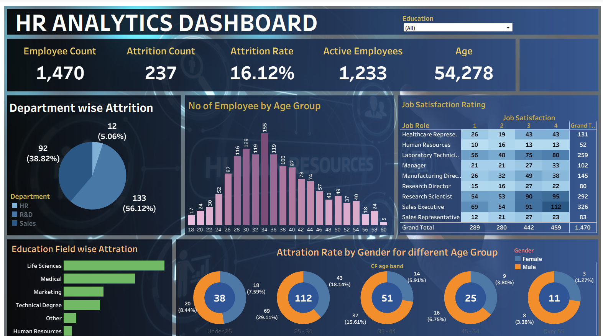

# 📊 HR Analytics Dashboard — Power BI

An interactive **HR Analytics Dashboard** built using **Microsoft Power BI** to analyze employee demographics, workforce distribution, experience, salary slabs, job roles, and employee attrition.

The dashboard is designed to help HR teams understand workforce patterns and identify areas that may require further analysis.

---

## 🖼️ Dashboard Preview



> **Note:** Replace `Dashboard.png` with the exact filename of your uploaded dashboard screenshot if it is different.

---

## 🎯 Project Objective

The objective of this project is to create an interactive HR analytics report that provides a clear overview of:

- Total employees
- Active employees
- Employee attrition
- Attrition rate
- Average employee age
- Average experience
- Department-wise workforce
- Age-group distribution
- Gender-wise attrition
- Salary-slab-wise attrition
- Job-role and job-satisfaction analysis
- Attrition trends by experience

---

## 🛠️ Tools & Technologies

- **Microsoft Power BI**
- **Power Query**
- **DAX**
- **Microsoft Excel** / tabular data source
- Data Cleaning & Transformation
- Data Visualization
- KPI & Dashboard Design

---

## 📌 Key KPIs

| KPI | Value |
|---|---:|
| Total Employees | 1,417 |
| Active Employees | 1,186 |
| Attrition Count | 231 |
| Attrition Rate | 16.30% |
| Average Age | 36.94 |
| Average Experience | 7.04 years |

---

## 📈 Dashboard Features

### 1. Department Analysis
The dashboard provides department-level analysis for:

- Administration
- Finance
- Human Resources
- IT
- Marketing
- Operations
- Sales

Users can select a department from the left-side department filter to analyze the dashboard dynamically.

### 2. Attrition Analysis

The report analyzes employee attrition across multiple dimensions:

- Department
- Salary slab
- Job role
- Job satisfaction
- Gender
- Experience

### 3. Age Group Distribution

Employees are analyzed across the following age groups:

- 18–25
- 26–35
- 36–45
- 46–55
- 55+

### 4. Salary Slab Analysis

Attrition is analyzed across salary ranges such as:

- 0–3 LPA
- 3–6 LPA
- 6–10 LPA
- 10+ LPA

### 5. Job Role & Job Satisfaction

A matrix visual compares different job roles against job satisfaction levels from **1 to 4**, along with total attrition.

### 6. Gender Analysis

The dashboard provides a comparison of attrition by gender.

### 7. Experience Analysis

An attrition trend is displayed against total years of employee experience to identify experience-related patterns.

### 8. Department-wise Employee Count

A funnel-style visualization compares the employee count across departments.

---

## 🔍 Business Questions Answered

This dashboard can be used to answer questions such as:

1. How many employees are currently in the organization?
2. How many employees have left the organization?
3. What is the overall attrition rate?
4. Which departments have the highest employee count?
5. How is attrition distributed across departments?
6. Which salary slab has more employees and attrition?
7. Which age group contains the most employees?
8. How does attrition vary by gender?
9. Which job roles show higher attrition?
10. How does employee experience relate to attrition?
11. How does job satisfaction vary across job roles?

---

## 📊 Visualizations Used

The dashboard includes:

- KPI Cards
- Donut Charts
- Bar Charts
- Funnel Chart
- Line/Area Chart
- Matrix
- Slicers
- Interactive Filters

---

## 🧹 Data Preparation

The data was prepared and transformed before visualization.

Typical preparation steps include:

- Removing duplicate records
- Handling missing values
- Checking data types
- Creating calculated columns/measures
- Grouping employees into age groups
- Creating salary slabs
- Preparing experience-related fields
- Validating employee and attrition counts

---

## 🧮 Key Calculations

Example Power BI/DAX measures used for HR analysis include:

### Total Employees

```DAX
Total Employees = COUNTROWS(EmployeeData)
```

### Attrition Count

```DAX
Attrition Count =
CALCULATE(
    COUNTROWS(EmployeeData),
    EmployeeData[Attrition] = "Yes"
)
```

### Active Employees

```DAX
Active Employees =
CALCULATE(
    COUNTROWS(EmployeeData),
    EmployeeData[Attrition] = "No"
)
```

### Attrition Rate

```DAX
Attrition Rate % =
DIVIDE(
    [Attrition Count],
    [Total Employees],
    0
)
```

> Update the table/column names if your actual Power BI model uses different names.

---

## 📂 Repository Structure

Recommended GitHub structure:

```text
HR-Analytics-Dashboard/
│
├── README.md
├── HR_Analytics_Dashboard.pbix
├── HR_Analytics_Data.xlsx
├── Dashboard.png
└── screenshots/
    ├── dashboard-overview.png
    └── dashboard-details.png
```

If you don't want to upload the dataset, you can remove `HR_Analytics_Data.xlsx` from the structure.

---

## 🚀 How to Open the Project

1. Download the `.pbix` file from this repository.
2. Install Microsoft Power BI Desktop.
3. Open `HR_Analytics_Dashboard.pbix`.
4. If Power BI asks for the data source, reconnect it to the included dataset.
5. Refresh the data.
6. Explore the dashboard using the available slicers and filters.

---

## 💡 Skills Demonstrated

This project demonstrates practical skills in:

- Data Analysis
- Data Cleaning
- Data Transformation
- Power BI
- DAX
- Power Query
- KPI Development
- Data Visualization
- Dashboard Design
- Business Insights
- Interactive Reporting

---

## 👨‍💻 Author

**Deepesh Kumar**

Aspiring Data Analyst | Power BI | SQL | Excel | Python | Tableau

---

## ⭐ Project

If you find this project useful, feel free to ⭐ the repository.

